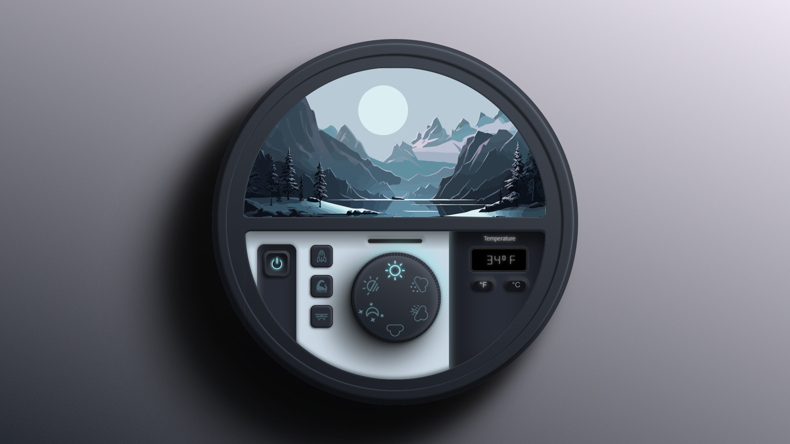
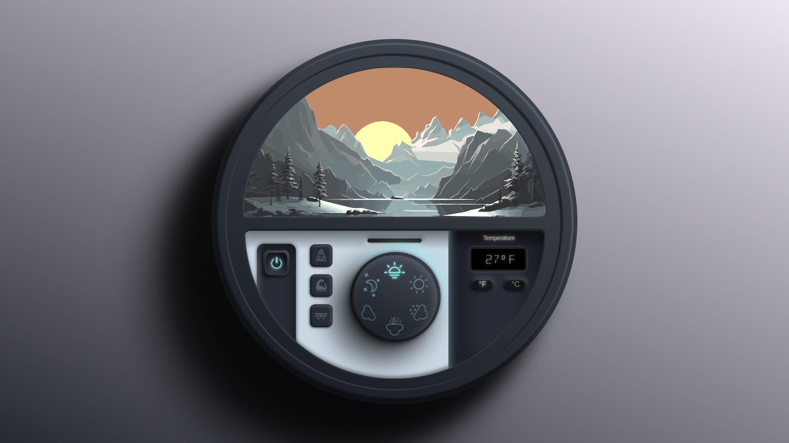

<div align="center">
  
  
  
  
  
  [](https://twitter.com/intent/follow?screen_name=Adnan__Bhaldar)

  <br />
  <br />
  
  
  <h2 align="center">Anime Changing Scenery</h2>

  A fully responsive interactive weather widget with beautiful animated anime-style scenes. <br />
  Features dynamic weather transitions, temperature display, and engaging visual effects.

   <a href="https://adnan-bhaldar.github.io/Anime-Changing-Scenery/"><strong>➥ Live Demo</strong></a>

</div>

---

## ✨ Features

- **🎨 6 Weather Modes**: Sun, Sunset, Moon, Clouds, Storm, and Snow
- **🌡️ Temperature Display**: Real-time animated temperature with °F/°C toggle
- **🎬 Smooth Animations**: Fluid transitions between weather scenes
- **⌨️ Keyboard Navigation**: Use arrow keys or spacebar to change scenes
- **📱 Fully Responsive**: Works on all devices and screen sizes
- **♿ Accessible**: Includes ARIA labels, skip links, and keyboard support
- **🎮 Interactive Elements**: Rocket, monster, and biplane animations
- **✨ Modern UI**: Glassmorphism design with glowing accents

---

## 🚀 Quick Start

### Prerequisites

- [Git](https://git-scm.com/downloads) - Version control system
- A modern web browser (Chrome, Firefox, Safari, Edge)

### Installation

1. Clone the repository:

```bash
# Linux/macOS
git clone https://github.com/adnan-bhaldar/Anime-Changing-Scenery.git

# Windows
git clone https://github.com/adnan-bhaldar/Anime-Changing-Scenery.git
```

2. Navigate to the project directory:

```bash
cd Anime-Changing-Scenery
```

3. Open `index.html` in your browser:

```bash
# macOS
open index.html

# Linux
xdg-open index.html

# Windows
start index.html
```

Or simply double-click the `index.html` file.

---

## 🎯 Usage

### Controls

| Control | Action |
|---------|--------|
| Click dial | Cycle through weather modes |
| Arrow Right / Spacebar | Next weather mode |
| Arrow Left | Previous weather mode |
| °F / °C buttons | Toggle temperature unit |
| Power button | Turn widget on/off |

### Weather Modes

1. **☀️ Sun** - Bright daytime scene
2. **🌅 Sunset** - Warm evening colors
3. **🌙 Moon** - Peaceful night with stars
4. **☁️ Clouds** - Cloudy atmosphere
5. **⛈️ Storm** - Lightning and rain effects
6. **❄️ Snow** - Winter snow scene

---

## 🛠️ Tech Stack

- **HTML5** - Semantic markup
- **CSS3** - Styling with animations and transitions
- **JavaScript (ES6+)** - Interactive functionality
- **SVG** - Vector graphics and animations
- **Google Fonts** - Typography (Orbitron, Rajdhani)

---

## 📁 Project Structure

```
Anime-Changing-Scenery/
├── index.html          # Main HTML file
├── assets/
│   ├── css/
│   │   └── style.css   # All styles
│   └── js/
│       └── main.js     # JavaScript functionality
├── Desktop.png         # Preview image
├── Desktop2.png        # Screenshot
├── LICENSE             # MIT License
└── README.md           # Documentation
```

---

## 🎨 Customization

### Changing Colors

Edit the CSS variables in `assets/css/style.css`:

```css
:root {
    --accent-cyan: #5ee7df;     /* Primary accent color */
    --accent-amber: #f5a623;    /* Secondary accent */
    --accent-warm: #ff6b6b;     /* Warning/highlight */
    --bg-primary: #1a1d24;      /* Background color */
}
```

### Adding New Weather Modes

1. Add a new entry in `weatherModes` array in `assets/js/main.js`
2. Add corresponding CSS classes for the new mode
3. Update the SVG scene as needed

---

## 🔧 Browser Support

| Browser | Version |
|---------|---------|
| Chrome | 80+ |
| Firefox | 75+ |
| Safari | 13+ |
| Edge | 80+ |

---

## 📄 License

This project is licensed under the MIT License - see the [LICENSE](LICENSE) file for details.

---

## 🤝 Contributing

Contributions are welcome! Feel free to submit a Pull Request.

1. Fork the repository
2. Create your feature branch (`git checkout -b feature/AmazingFeature`)
3. Commit your changes (`git commit -m 'Add some AmazingFeature'`)
4. Push to the branch (`git push origin feature/AmazingFeature`)
5. Open a Pull Request

---

## 📧 Contact

- **Twitter**: [@Adnan__Bhaldar](https://twitter.com/Adnan__Bhaldar)
- **GitHub**: [adnan-bhaldar](https://github.com/adnan-bhaldar)

---

## 🙏 Acknowledgments

- Design inspired by anime landscape aesthetics
- Built with pure HTML, CSS, and JavaScript
- No external dependencies required

---

<br />

### Demo Screenshots


